# Holiday Destination Finder
## User Experience
### Key information
- External user’s goal:
Find the best holiday destination for their needs.
- Site owner's goal:
Get users to choose a travel package from this site and/or from its sponsors.
### User stories
- First Time Visitor Goals
  1. As a First Time Visitor, I want to easily understand the main purpose of the site.
  2. As a First Time Visitor, I want to be able to easily navigate throughout the site to find information.
- Returning Visitor Goals
  1. Search for holiday destinations, view relevant attractions, accommodations, and restaurants, and explore these on a visually interactive map.
  2. Choose a travel package from this site and/or from its sponsors.
- Frequent Visitor Goals
  1. Search for holiday destinations, view relevant attractions, accommodations, and restaurants, and explore these on a visually interactive map.
  2. Choose a travel package from this site and/or from its sponsors.
  
## Design
### Color Scheme
The color scheme for this website is designed to be clean and simple, with a focus on readability.

- **Background Color**: The background is set to **white** (#FFFFFF) to provide a clean, minimalistic look, ensuring that the content remains the focal point.
- **Primary Color**: The main accents of the website are in **blue** and **light blue**. They are used for buttons and navigation bar, guiding the user’s attention and also matching the map color.
- **Text Color**: The primary font color is **black** (#000000) for optimal contrast against the white background, ensuring readability across all devices and environments.

This simple color scheme enhances the user experience by focusing on clarity, ease of navigation, and visual comfort.

### Typography
For the text styling of this website, the **Arial** font is chosen. Arial is a clean, sans-serif font known for its legibility and simplicity. It provides a modern and accessible reading experience, ensuring the content is easy to read for a wide range of users.

In the case that Arial is not available on the user's device, the fallback font is any available **sans-serif** font to maintain a clean, readable style.

### Wireframes
Below is the wireframe for this project:
- Desktop View
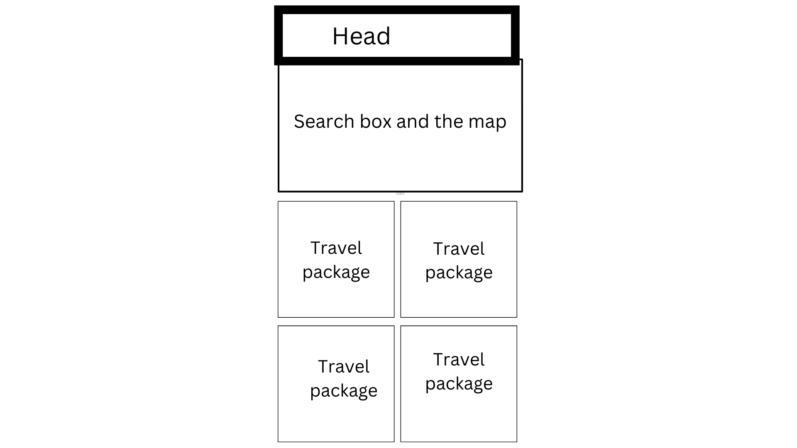
- Mobile View
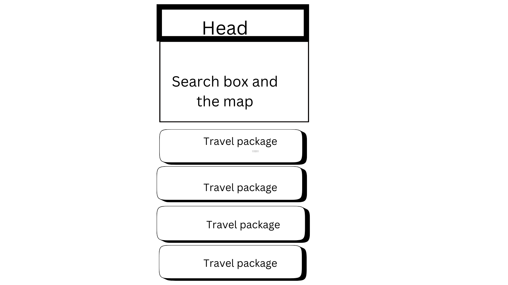
- Tablet View
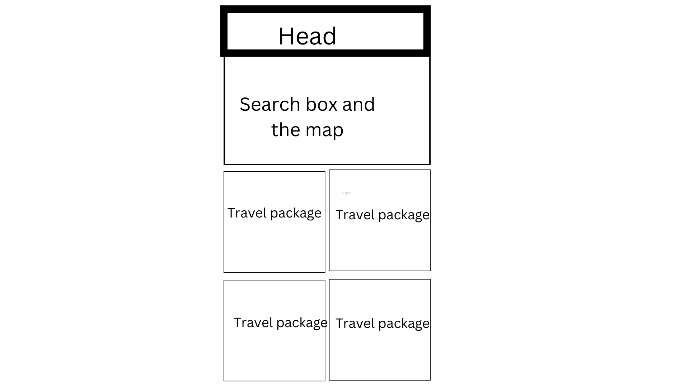
## Features
### Navigation Bar
Kept on top of other content all the time, it includes links to the search section and top offers to allow for easy navigation for users.

### Locaiton Search
- Users can input a place name to find location and relevant travel details.
- If the input field is empty, an alert is shown asking the user to enter a location.
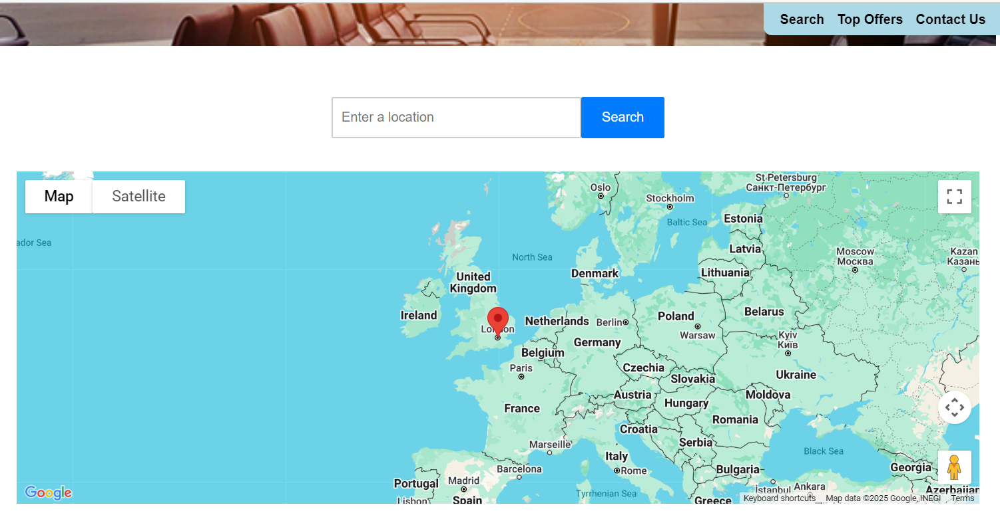
### Interactive Map
- A map with an original marker in London is presented to engage users to search.
- The map is updated to center on the location of the searched place.
- A marker is added at the place's location, and the map zooms in for a closer view.
### Accomodation
Shows a list of hotels or other accommodations available in the searched location.
### Restaurant
Displays recommended restaurants for the selected destination.
### Attraction
Lists popular tourist attractions or things to do in the area.
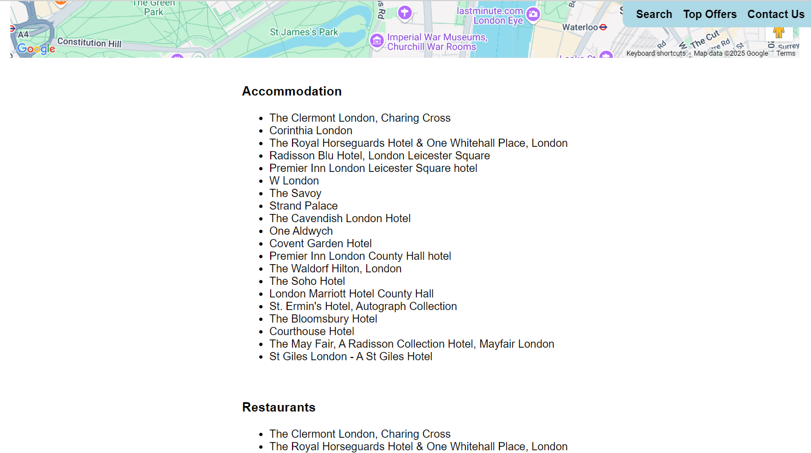
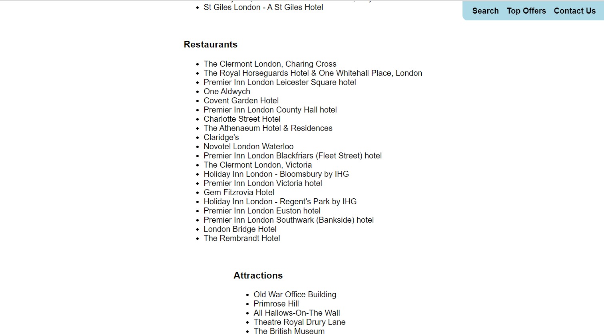
### Top offers
Gives selected travel packages of famous destinations to attract the users to make orders on the website.
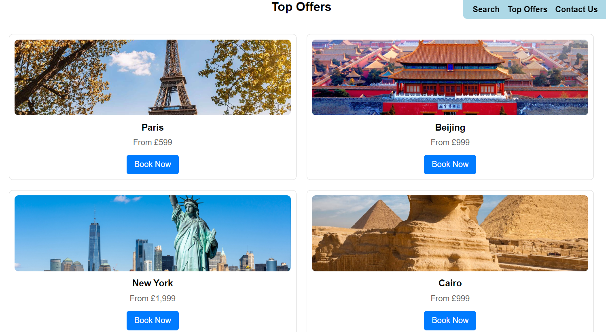
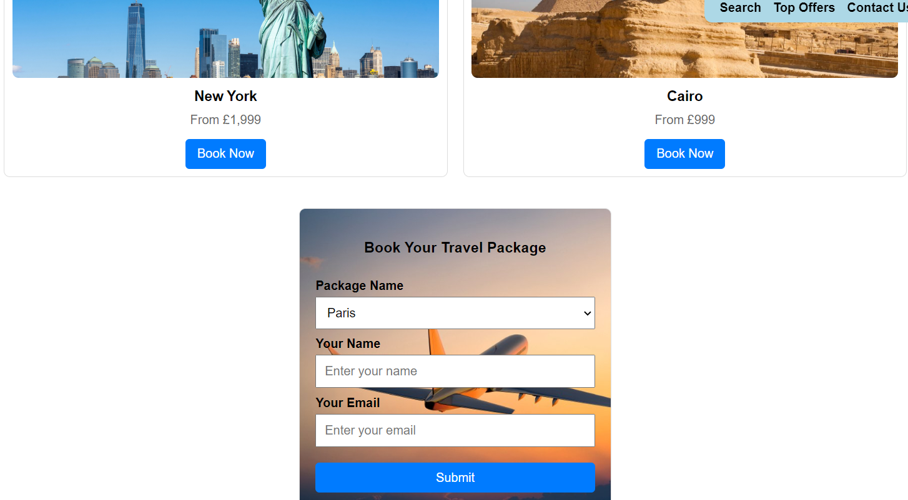
### Contact Us
Contact information of the websitre.
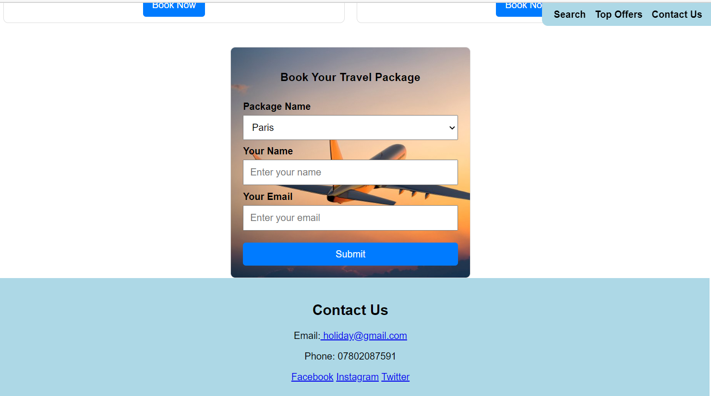
## Technologies Used
### Language used
- HTML
- CSS
- Javascript
### Frameworks, Libraries & Programs Used
- Canva

## Deployment

This project is hosted and deployed on GitHub. 
[Deployment Link](https://friendly-malasada-77d708.netlify.app/)
You can access the code repository at the following link:
[GitHub Repository Link](https://wendytan66.github.io/holidayfinder/)

## Testing
### Validator Testing
- The W3C Markup Validator and W3C CSS Validator Services were used to validate every page of the project to ensure there were no syntax errors in the project.
During the validation of the CSS, a **Parse Error** related to the `font-family: Arial, sans-serif;` is encountered. The issue was resolved after specifying 'h1' and 'body' to it.
### Map Search Testing
__Test submission__
- **Steps**
  1. Input 'Edinburgh' in the search bar.
  2. Click 'Search'.
- **Expected Results**
  1. The map marker will be relocated in Edinburgh and the area is zoomed in.
  2. Relevant recommendations on accomodation, restaurant and attractions in Edinburgh will be listed under the map.

__Test Validation__
- **Steps**
  1. Leave the bar empty.
  2. Click 'Search'.
- **Expected Result:** 
  Error messages should appear for missing fields.

__Test Responsiveness__
- **Steps:** 
  1. Use Search on different devices (e.g., phone, tablet, desktop).
- **Expected Result:** 
  The map should be easy to use on all devices.
### Top offers Testing
__Test submission__
- **Steps**
  1. Click "Buy Now" button.
  2. Fill out the form with valid details.
  3. Click 'Submit'.
- **Expected Results**
  You should see a confirmation message.

__Test Validation__
- **Steps**
  1. Leave some required fields empty.
  2. Click 'Submit'.
- **Expected Result:** 
 Error messages should appear for missing fields.

__Test Responsiveness__
- **Steps:** 
  1. Use Buy Now button on different devices (e.g., phone, tablet, desktop).
- **Expected Result:** 
  It should be easy to use on all devices.
    
__Report Issues__
- **Contact:** Email [wendytanvalencia@gmail.com].
  
### Further Testing
- The Website was tested on Google Chrome,Microsoft Edge and Safari browsers.
- **Microsoft Edge:**
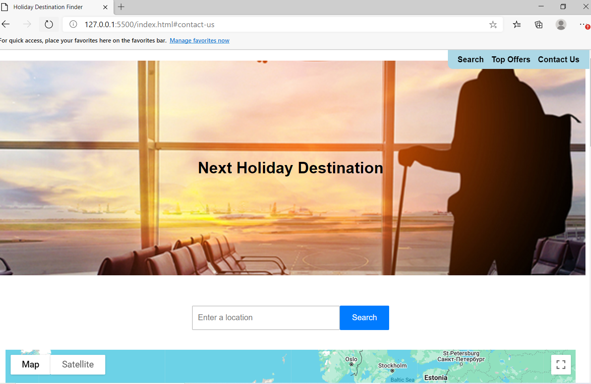
- **Google Chrome:**
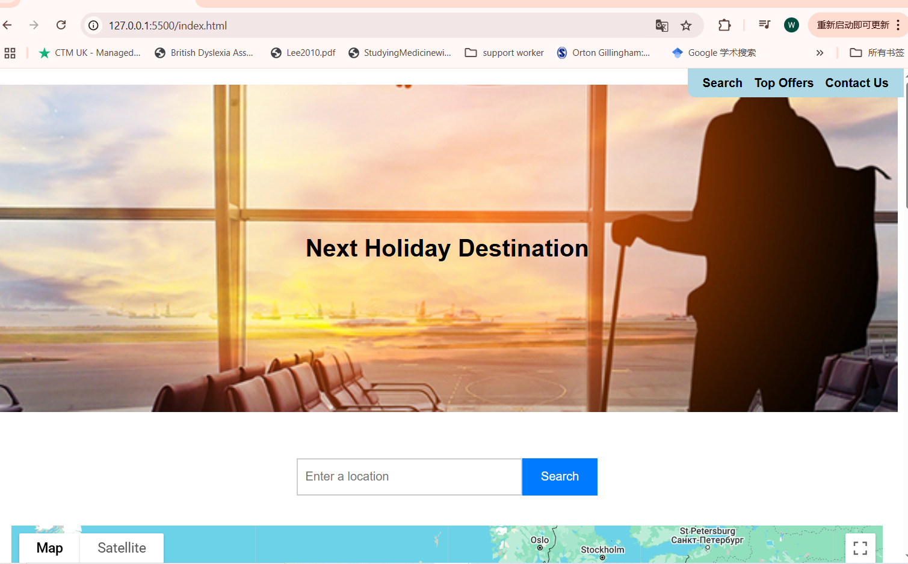
- **Mozilla Firefox:**
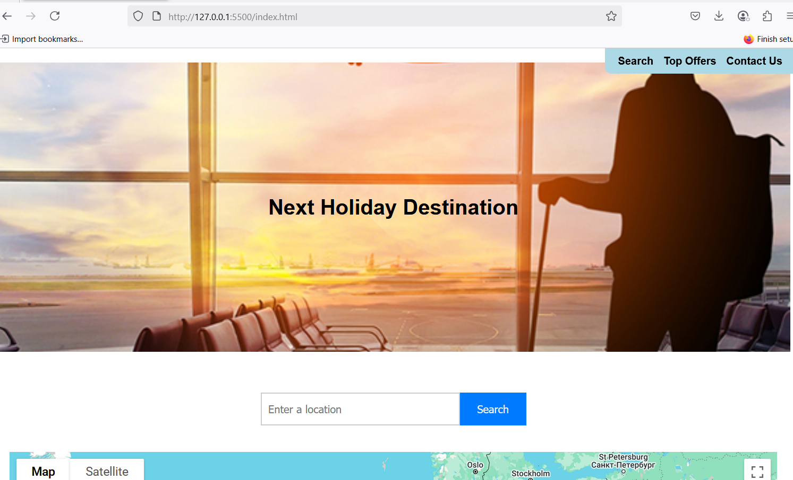

## Bug
- Google Map was not loaded. It was caused by invalid API key. To fix that, make sure goolge cloud account is paid on time and map API function is not restricted.
- When submitting the "Buy Now" booking form, users encounter a 405 Not Allowed error. This is because there is no backend server to handle this request. This error has not been fixed.
- **Contact Us** is not properly linked in navigation bar. The cause was the id was written incorrectly in html coding.

## Version Control
This project uses Git for version control. 
- - **Repository**: The project is maintained in a Git repository, which helps track changes and manage the project’s history.
- - **Commits**: Changes are committed with descriptive messages to keep track of modifications and updates.
- - **Commit Messages**: Descriptive commit messages are used to explain the purpose of each change.
- - **Main Branch**: The `main` branch represents the latest stable version of the project. All final changes are merged into this branch.
 

## Credits

- The images used on this website are sourced from various platforms. Below are the appropriate credits for each image:

  1. **paris** - Image source: [The Trainline](https://www.thetrainline.com/via/europe/france/paris/visiting-the-eiffel-tower)
  2. **beijing** -Image source: [Travel the World]
(https://www.katherinebelarmino.com/2014/01/forbidden-city-jingshan-park.html)
  3. **cairo** -Image source: [World Travel Guide]
(https://www.worldtravelguide.net/features/city-highlight/city-highlight-cairo/)
  4. **newyork** -Image source:[Travcel Guide]
(https://www.travelguide.net/new-york/)
  5. **header**-Image source:[Travel Weekly]
(https://pe-insights.com/travelperk-acquires-yokoy-following-200m-equity-raise-to-strengthen-travel-tech-expansion/)
  6. 5. **form backgrouind**-Image source:[Hotel kriopigi]
(https://hotelkriopigi.gr/tips-traveling-airplane/)

- The implementation of Google Maps on this website was made possible by the tutorial provided by [Google Maps API Documentation](https://developers.google.com/maps/documentation/javascript/adding-a-google-map). The tutorial helped guide the integration of Google Maps into the website.

  

